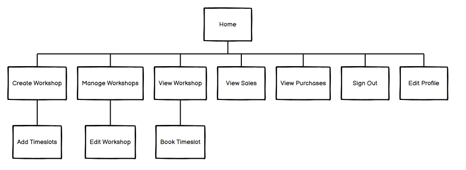
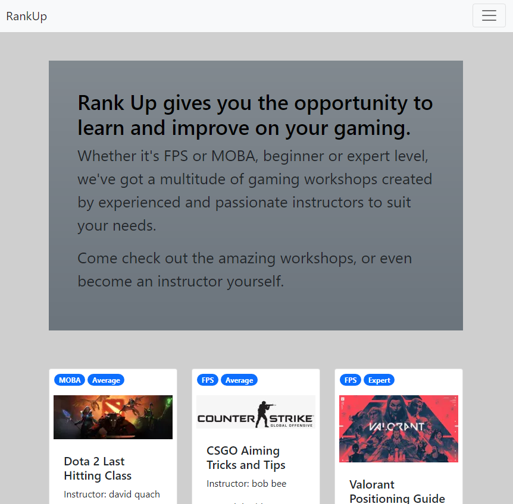
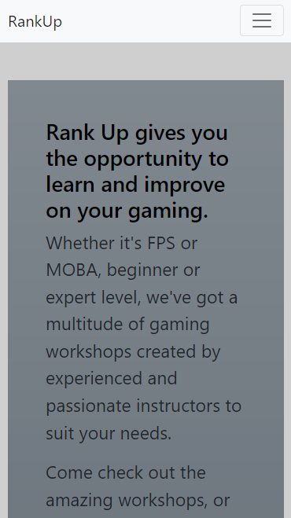
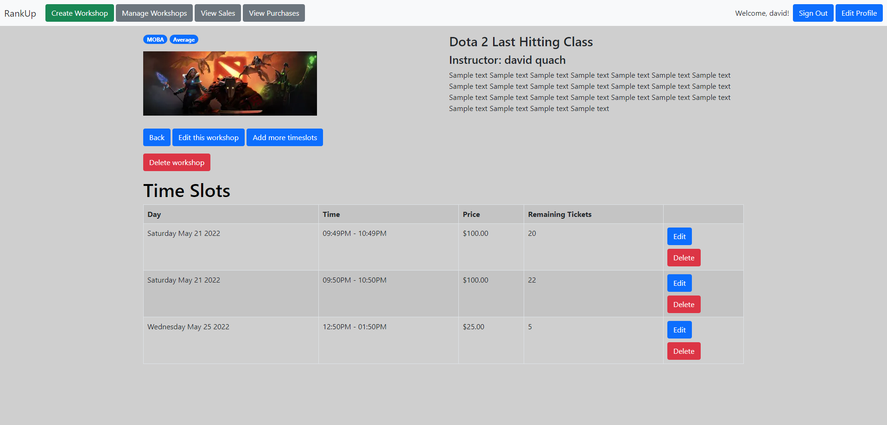
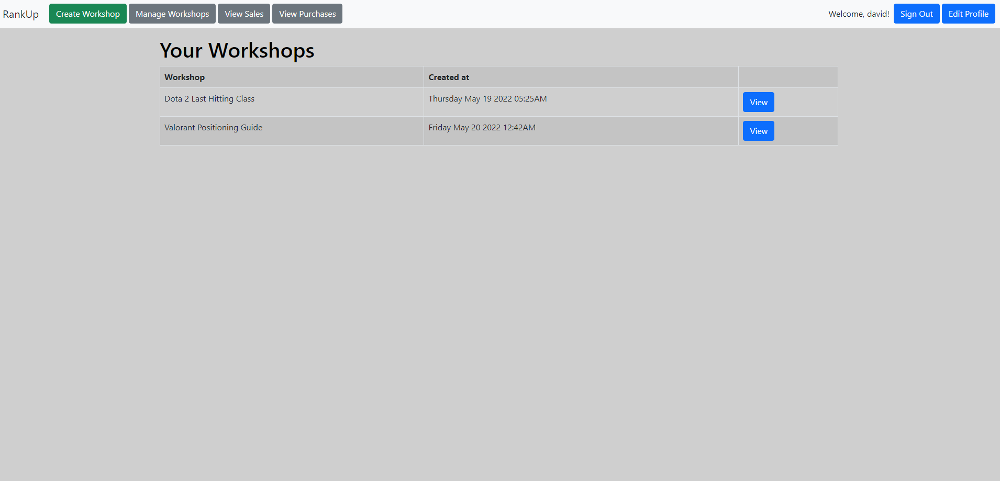
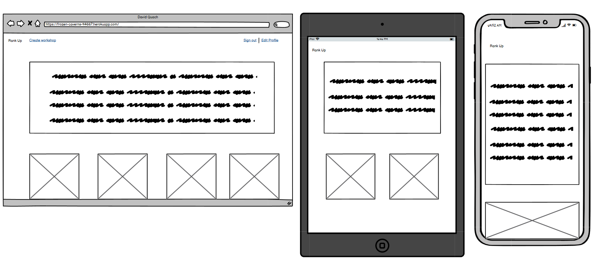
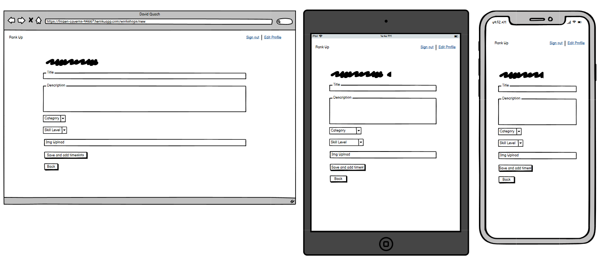
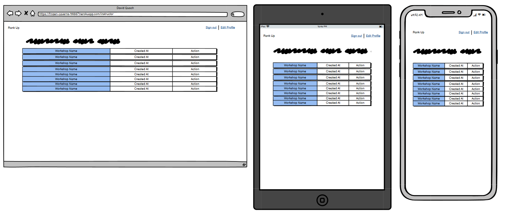
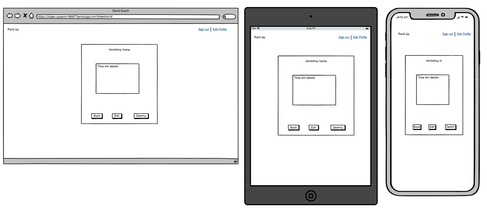
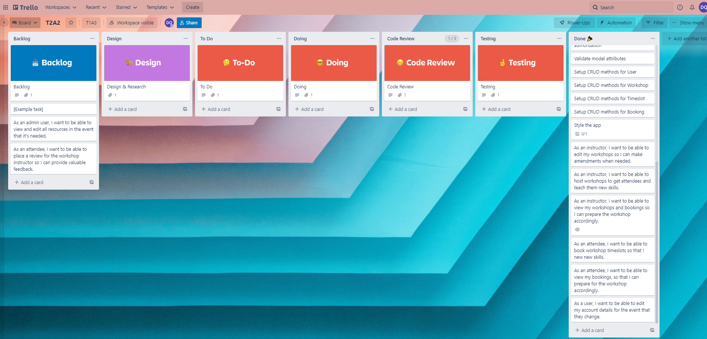

# T2A2 - MARKETPLACE APPLICATION - RANKUP
## [Repository](https://github.com/quachck/DavidQuach_T2A2)

## [Live App](https://frozen-caverns-94667.herokuapp.com/)

## The Problem
One of the main appeals of video gaming is that you can have endless hours of fun without stepping a foot out of the house and why would you. There’s not much incentive for a gamer to physically travel to some location to do the exact same thing they could’ve done in the comfort of their own home, especially if they must pay for it.  On the off chance that someone is actually looking for gaming related services or even to provide these services themselves in a physical setting they’ll find themselves short on luck. Online coaching is what’s commonly used due its accessibility which makes it an excellent marketplace to disrupt.

## Purpose and Target Audience
It’s very difficult to obtain or offer gaming services such as coaching in a physical environment due its redundant nature, you’d usually just achieve this online using a mic and webcam. The Rank Up marketplace app aims to bring people who wish to learn new or improve on their current gaming skillset and people who wish to share their knowledge with an emphasis on face to face contact. The app is targeted for anyone interested in gaming to sweaty enthusiasts who wish to gain an upper edge against their online enemies. 

## Functionality/Features
Rank Up is a 2 sided gaming service marketplace app, users who wish to share their wisdom can join as an `instructor`. An instructor can host gaming `workshops` on a particular topic or skill and users who wish to learn about these topics can join as `attendees` and `book` a workshop `timeslot`. Users can be both an instructor and attendee and are able to view or edit their workshops or bookings at any time via their dashboard. Currently, the paymeny system is not set up so anyone can book a timeslot.


## Sitemap

 

## Screenshots

Home - Desktop

 

Home -Tablet

 

Home - Mobile

 

Workshop show page

 

Manage workshops page

 

## Wireframes

Home

 

New workshop

 

Show workshop

 

Show workshops

 

Create timeslot

 


## Technology Stack

- Ruby on Rails Framework
- HTML, CSS
- Bootstrap
- Wireframes/sitemap: Balsamiq Wireframes
- Cloud storage: Cloudinary
- Database: PostgresQL
- Deployment: Heroku

## Third Party Services

**Cloudinary**

It could take a long time to load websites and files such as images and videos depending on how far you are from where it’s hosted. This issue is resolved through using a content delivery network (CDN) where instead of having just 1 server to host the files, multiple CDN servers are placed at internet exchange points across the globe. This greatly improves content availability, reduces bandwidth costs and improves website loading times and security. Cloudinary is used to host images for the app as it uses the optimised CDN, allowing for quick image loading times.

**Heroku**

Heroku is a container-based cloud Platform as a Service, and will be used to deploy the app due to its performance and ease of use. Applications are dependent on dynos, which are isolated virtualised Unix containers and affect how well the app will scale. Free accounts have limited dynos but is more than sufficient for the size of tis app. Since the app uses other third party services and databases that require credentials and environment variables, we must configure Heroku to be able to read them in order to successfully deploy the app.

## Project Tracking

I began by brainstorming app ideas, once it was approved I read through the rubrik and began to create my user stories and tasks and used [Trello](https://trello.com/b/8hxMLkxW/t2a2) to track them. 

**User stories**

- As an instructor, I want to be able to edit my workshops so I can make amendments when needed.
- As an instructor, I want to be able to host workshops to get attendees and teach them new skills.
- As an instructor, I want to be able to view my workshops and bookings so I can prepare the workshop accordingly.
- As an attendee, I want to be able to book workshop timeslots so that I new new skills.
- As an attendee, I want to be able to view my bookings, so that I can prepare for the workshop accordingly.
- As a user, I want to be able to edit my account details for the event that they change.
- As an admin user, I want to be able to view and edit all resources in the event that it's needed. (not implemented)
- As an attendee, I want to be able to place a review for the workshop instructor so I can provide valuable feedback.(not implemented)


**Trello Board**

 


## Abstactions
In order to achieve the desired app, 4 key components are needed – User, Workshop, Timeslot and Booking.

**User** – apps are created for the user, it’s the most important component and will be used to model the `instructors` and `attendees` of the app. User information will be used to help setup the rest of the app.

**Workshop** – This is how the user will be able to either receive or offer gaming services. The workshop could be anything gaming related, “How to maximize efficiency when doing X in Y situation”, “How to improve X ability in Y game” for example. A user can create a workshop listing, becoming its instructor, however an attendee would not book this workshop directly, it needs to be abstracted 1 level further. 

**Timeslot** – Since a workshop could have multiple timeslots (probably makes more sense to name it sessions instead), it needs its own table. This is actual entity that the attendee will be booking.

**Booking** – Allows users to book a timeslot, the booking will belong to an attendee and an instructor, this will be used to track who booked what and will be displayable in a booking history page.

I used shallow nesting to ensure the routes didn't get too clustered.

```rb
 resources :workshops, shallow: true do
    resources :timeslots, shallow: true do
      resources :bookings
    end
  end
```

## Active Record Associations
### User

A user can create many workshops. The `user workshop` relation is `many to many`.
``` rb
has_many :workshops, dependent: :destroy
```

A user can have many bookings, the `:class_name` option is used to differentiate between who booked it, the `attendee` and who the `instructor` of that booking is. There is no `user booking` relation, we need to use the alias names instead. The `attendee purchase` relation is `one to many`. The `instructor sale` relation is `one to many`.

``` rb
has_many :sales, class_name: "Booking", dependent: :destroy, foreign_key: "instructor_id"
has_many :purchases, class_name: "Booking", dependent: :destroy, foreign_key: "attendee_id"
```

### Workshop

A workshop belongs to 1 user, the instructor.

``` rb
belongs_to :user
```
A workshop can have many timeslots. The `workshop timeslot` relation is `one to many`.

``` rb
has_many :timeslots, dependent: :destroy
```
A workshop has one img.

``` rb
has_one_attached :img
```

### Timeslot

A timeslot belongs to one workshop. 
``` rb
  belongs_to :workshop
```

A timeslot can have many bookings. The `timeslot booking` relation is `one to many`.

``` rb
  has_many :bookings, dependent: :destroy
```

### Booking

A booking belongs to one booking. 
``` rb
belongs_to :timeslot
```
A booking will belong 2 users, an instructor and an attendee, the `:class_name` option is used to differentiate between who booked it, the `attendee` and who the `instructor` of that booking is.

``` rb
belongs_to :instructor, class_name: "User"
belongs_to :attendee, class_name: "User
```

##  Database Relations

The general flow of the data base is as follow, a `user` will sign up to create an account. They can then create a `workshop` and allocate `timeslots` to it, this will create and make the listing visible on the app. A user can now when `book` a timeslot for that workshop if they wish. The attributes for each table and the relations between them are fairly straight forward consisting of mainly `one to many` relations. The only small issue was establishing the relation between users and bookings, a user can have many bookings and a booking belongs to exactly 2 users. It's not possible to use `user_id` as a foreign key twice in the booking table, the solution is to use the `:class_name` option to establish this relation. The timeslot should have been more appropriately named session and the `available_tickets` attributes should probably be on it's own table to meet normalistion. The `location` attribute should have also been an address referenced in another table.

This is only the MVP, unfortunately I wasn't able to implement all the features I wanted to - review ability, payment and a maps API.

### User

 The user table has the following attributes (*ruby data types*)
  -  `first_name:string`
  - `last_name:string`
  - `number:integer`
  - `email:string`
  - `password:string`

### Workshop

 The workshop table has the following attributes (*ruby data types*)
  -  `user_id:bigint`
  - `titles:string`
  - `description:text`
  - `categorys:string`
  - `skill_levels:string`
  - `locations:string`

### Timeslot

 The timeslot table has the following attributes (*ruby data types*)
  -  `workshop_id:bigint`
  - `day:date`
  - `start_time:time`
  - `end_time:time`
  - `price:decimal`
  - `available_tickets:integer`

### Booking

 The booking table has the following attributes (*ruby data types*)
  -  `timeslot_id:bigint`
  - `instructor_id:integer`
  - `attendee_id:integer`

## ERD And Database Schema Design

 


  
